# Brain tumor segmentation in MRI images using U-Net

Here, I have implemented a U-Net from the paper ["U-Net: Convolutional Networks for Biomedical
Image Segmentation"](https://arxiv.org/pdf/1505.04597.pdf) to segment tumor in MRI images of brain.

There are 3 types of brain tumor:
1. meningioma
2. glioma
3. pituitary tumor

## Examples of predicted tumor segment by the current U-Net implementation.
meningioma       	  | glioma		| 	pituitary tumor             
:-------------------------:|:-------------------------:|:------------------------:
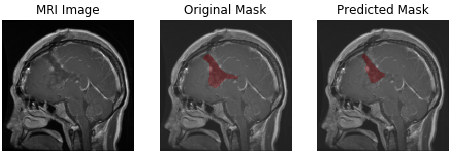  |  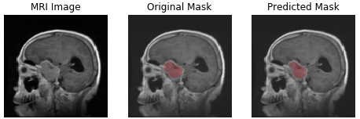		| 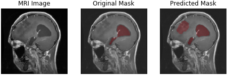
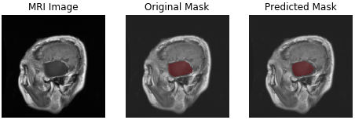  |  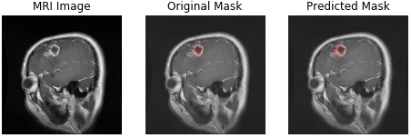		| 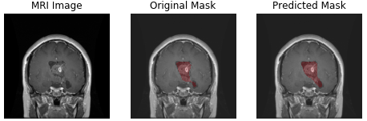 
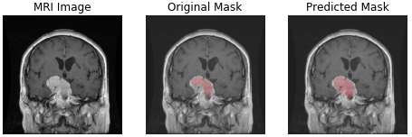  |  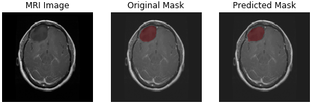		| 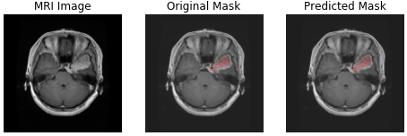 

## Getting Started
Here I will explain how to get the data and convert it into the usable form. You can run the train and run model using [notebook](https://github.com/adityajn105/brain-tumor-segmentation-unet/blob/master/brain-tumor-segmentation.ipynb).

### Prerequisites
You will need Python 3.X.X with some packages which you can install direclty using requirements.txt.
> pip install -r requirements.txt

### Get the Dataset
I have used brain-tumor segment dataset which is available on the internet. You can run [download_data.sh](https://github.com/adityajn105/brain-tumor-segmentation-unet/blob/master/download_data.sh) shell script to download all data. It contains 3064 MRI images and 3064 masks. 
> bash tumor-segmentation-unet/download_data.sh

After that run the following command to convert data in useable form.
> python tumor-segmentation-unet/mat_to_numpy.py brain_tumor_dataset/ 

## Model Architecture
I have used combination of multiple losses which includes binary crossentropy, dice loss with equal weightage. Also I have used Conv2D transpose layers for upsampling. 

I have used the metric called IOU (Intersection over Union) metric to track progress of training and trained Unet with Adam optimizer for 40-60 epochs with decaying learning rate between 1e-3 to 1e-4. I have also performed only one Image augmentation i.e. horizontal flip. Train and test split was stratified using type of tumor.

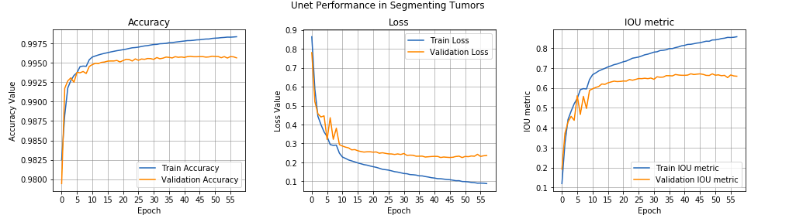

Detailed architecure is given below.
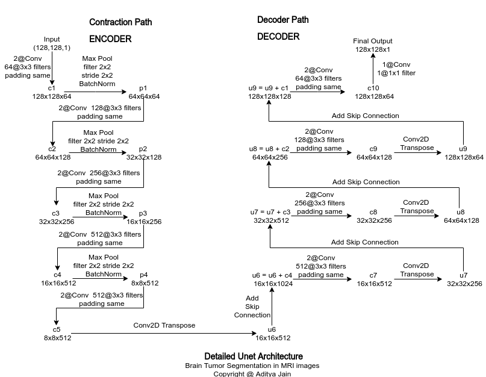

## Possible Improvements
1. Can use transfer learning to utilize state-of-the-art model like VGG, Inception, Resnet.
2. We can use more types of image augmentation like vertical flip, brightness, zoom etc.
3. Include lovasz loss with higher weightage.
4. Learn and use Hypercolumns

## Author:
* Aditya Jain : [Portfolio](https://adityajain.me)

## To Read:
1. [U-Net: Convolutional Networks for Biomedical Image Segmentation](https://arxiv.org/pdf/1505.04597.pdf)
2. [Image Segmentation, ConvNet, FCN, Unet](https://towardsdatascience.com/understanding-semantic-segmentation-with-unet-6be4f42d4b47)
3. [Up-sampling with Transposed Convolution](https://towardsdatascience.com/up-sampling-with-transposed-convolution-9ae4f2df52d0)
4. [Lovasz Loss](https://arxiv.org/abs/1705.08790) 
5. [Jaccard Index - Intesection over Union](https://www.jeremyjordan.me/evaluating-image-segmentation-models/)
6. [Understanding Dice Loss](https://forums.fast.ai/t/understanding-the-dice-coefficient/5838)
7. [Another Image Segmentation Problem](https://github.com/adityajn105/TGS-Salt-Identification-Image-Segmentation-)